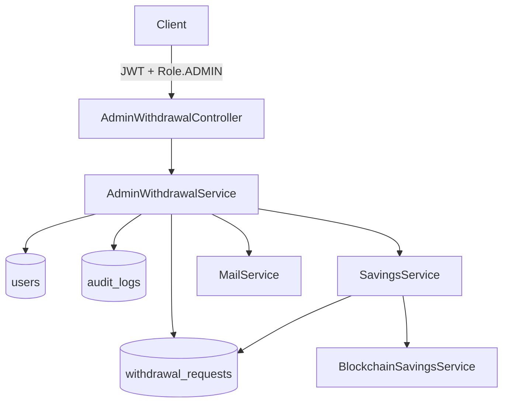

# Design Document: Admin Withdrawal Management

## Overview

This feature adds an admin-facing API layer for managing withdrawal requests in the Nestera backend. It follows the established admin module patterns (JWT + RBAC guards, paginated responses, audit logging) and integrates with the existing `SavingsService.processWithdrawal` flow rather than reimplementing it.

The implementation adds:

- `AdminWithdrawalController` — REST endpoints under `/v1/admin/withdrawals`
- `AdminWithdrawalService` — business logic for listing, approving, rejecting, and stats
- Two new `MailService` methods for approval/rejection emails
- `AuditLog` persistence for every mutating admin action

---

## Architecture



The controller is thin — it validates input, extracts the current user, and delegates entirely to the service. The service owns all business logic and side effects (audit log, email). `SavingsService.processWithdrawal` is called (via a new public wrapper) to handle the PROCESSING → COMPLETED/FAILED transition so no withdrawal logic is duplicated.

---

## Components and Interfaces

### AdminWithdrawalController

Path prefix: `admin/withdrawals`, version `1`  
Guards: `@UseGuards(JwtAuthGuard, RolesGuard)` + `@Roles(Role.ADMIN)`

| Method | Path           | Description                        |
| ------ | -------------- | ---------------------------------- |
| GET    | `/pending`     | Paginated list of PENDING requests |
| GET    | `/stats`       | Aggregate statistics               |
| GET    | `/:id`         | Single request detail              |
| POST   | `/:id/approve` | Approve a PENDING request          |
| POST   | `/:id/reject`  | Reject a PENDING request           |

> Note: `/stats` and `/pending` must be declared before `/:id` to avoid route shadowing.

### AdminWithdrawalService

```typescript
listPending(opts: PageOptionsDto): Promise<PageDto<WithdrawalRequest>>
getDetail(id: string): Promise<WithdrawalRequest>
approve(id: string, actor: User): Promise<WithdrawalRequest>
reject(id: string, reason: string, actor: User): Promise<WithdrawalRequest>
getStats(): Promise<WithdrawalStatsDto>
```

### DTOs

**RejectWithdrawalDto**

```typescript
class RejectWithdrawalDto {
	@IsString()
	@IsNotEmpty()
	reason: string;
}
```

**WithdrawalStatsDto**

```typescript
interface WithdrawalStatsDto {
	total: number;
	byStatus: Record<WithdrawalStatus, number>;
	approvalRate: number; // percentage 0–100
	averageProcessingTimeMs: number;
}
```

### MailService additions

```typescript
sendWithdrawalApprovedEmail(userEmail: string, name: string, amount: string, penalty: string, netAmount: string): Promise<void>
sendWithdrawalRejectedEmail(userEmail: string, name: string, reason: string): Promise<void>
```

Both follow the existing fire-and-forget pattern (try/catch, log error, never throw).

---

## Data Models

No new database tables or migrations are required. The feature uses existing entities:

**WithdrawalRequest** (existing) — `status` and `reason` fields are updated by approve/reject actions.

**AuditLog** (existing) — one record written per approve/reject call with:

| Field           | Value                                                      |
| --------------- | ---------------------------------------------------------- |
| `correlationId` | from request header `x-correlation-id` (or generated UUID) |
| `endpoint`      | e.g. `/v1/admin/withdrawals/:id/approve`                   |
| `method`        | `POST`                                                     |
| `action`        | `APPROVE` or `REJECT`                                      |
| `actor`         | authenticated admin's email                                |
| `resourceId`    | `WithdrawalRequest.id`                                     |
| `resourceType`  | `WITHDRAWAL_REQUEST`                                       |
| `statusCode`    | HTTP response code                                         |
| `durationMs`    | elapsed ms from start of handler                           |
| `success`       | `true` on success, `false` on error                        |
| `errorMessage`  | error description on failure, `null` otherwise             |

**Module registration** — `AdminModule` must add `WithdrawalRequest`, `AuditLog` to `TypeOrmModule.forFeature([...])` and register `AdminWithdrawalController` and `AdminWithdrawalService`.

---

## Correctness Properties

_A property is a characteristic or behavior that should hold true across all valid executions of a system — essentially, a formal statement about what the system should do. Properties serve as the bridge between human-readable specifications and machine-verifiable correctness guarantees._

### Property 1: Pending list returns only PENDING records, correctly paginated and ordered

_For any_ set of withdrawal requests with mixed statuses and any valid `PageOptionsDto`, the `/pending` endpoint should return only records with `status = PENDING`, the `data` array length should not exceed `limit`, and records should be ordered by `createdAt` in the requested direction.

**Validates: Requirements 1.1, 1.2, 1.3**

---

### Property 2: Non-existent resource returns 404

_For any_ UUID that does not correspond to an existing `WithdrawalRequest`, calling the detail, approve, or reject endpoints should return a `404 Not Found` response.

**Validates: Requirements 2.2, 3.2, 4.3**

---

### Property 3: Approving a non-PENDING withdrawal returns 400

_For any_ `WithdrawalRequest` whose status is `PROCESSING`, `COMPLETED`, or `FAILED`, calling the approve endpoint should return a `400 Bad Request` response and leave the record unchanged.

**Validates: Requirements 3.3**

---

### Property 4: Rejecting a non-PENDING withdrawal returns 400

_For any_ `WithdrawalRequest` whose status is not `PENDING`, calling the reject endpoint should return a `400 Bad Request` response and leave the record unchanged.

**Validates: Requirements 4.4**

---

### Property 5: Approve transitions status to PROCESSING

_For any_ `WithdrawalRequest` with `status = PENDING`, calling approve should result in the record's status being updated to `PROCESSING` (triggering the async processing flow).

**Validates: Requirements 3.1**

---

### Property 6: Reject transitions status to FAILED and persists reason

_For any_ `WithdrawalRequest` with `status = PENDING` and any non-empty reason string, calling reject should result in `status = FAILED` and `reason` equal to the provided string.

**Validates: Requirements 4.1**

---

### Property 7: Empty or whitespace reason is rejected

_For any_ string composed entirely of whitespace (or an absent `reason` field), calling the reject endpoint should return a `400 Bad Request` response.

**Validates: Requirements 4.2**

---

### Property 8: Audit log is written with all required fields for every mutating action

_For any_ approve or reject action (successful or failed), an `AuditLog` record should be persisted containing non-null values for `correlationId`, `endpoint`, `method`, `action`, `actor`, `resourceId`, `resourceType`, `statusCode`, `durationMs`, and `success`.

**Validates: Requirements 3.4, 4.5, 7.1, 7.2**

---

### Property 9: Failed operations produce audit log entries with success = false

_For any_ approve or reject operation that throws an error, the persisted `AuditLog` entry should have `success = false` and a non-null `errorMessage`.

**Validates: Requirements 7.3**

---

### Property 10: Approval email is sent with correct financial fields

_For any_ successful approval, `MailService.sendWithdrawalApprovedEmail` should be called exactly once with the user's email, name, and the withdrawal's `amount`, `penalty`, and `netAmount`.

**Validates: Requirements 3.5, 6.1**

---

### Property 11: Rejection email is sent with the rejection reason

_For any_ successful rejection, `MailService.sendWithdrawalRejectedEmail` should be called exactly once with the user's email, name, and the provided `reason`.

**Validates: Requirements 4.6, 6.2**

---

### Property 12: Mail failure does not abort the operation

_For any_ approve or reject action where `MailService` throws an exception, the operation should still complete successfully (status updated, audit log written) and not propagate the mail error to the caller.

**Validates: Requirements 6.3**

---

### Property 13: Stats correctly aggregate all withdrawal requests

_For any_ set of withdrawal requests in the database, the stats endpoint should return `total` equal to the count of all records, `byStatus` counts summing to `total`, `approvalRate = (COMPLETED count / total) * 100` (or `0` when total is `0`), and `averageProcessingTimeMs` equal to the mean of `(completedAt - createdAt)` for COMPLETED records (or `0` when none exist).

**Validates: Requirements 5.1, 5.2, 5.3**

---

## Error Handling

| Scenario                    | Response                                                                          |
| --------------------------- | --------------------------------------------------------------------------------- |
| Withdrawal not found        | `404 Not Found` with message `Withdrawal request {id} not found`                  |
| Approve/reject non-PENDING  | `400 Bad Request` with message `Withdrawal request is not in PENDING status`      |
| Empty/missing reject reason | `400 Bad Request` (class-validator via `@IsNotEmpty()`)                           |
| Unauthenticated request     | `401 Unauthorized` (JwtAuthGuard)                                                 |
| Non-admin request           | `403 Forbidden` (RolesGuard)                                                      |
| Mail send failure           | Logged at WARN level, operation continues                                         |
| Audit log write failure     | Logged at ERROR level; should not abort the primary operation (wrap in try/catch) |

---

## Testing Strategy

### Unit Tests

Focus on specific examples, edge cases, and error conditions:

- `AdminWithdrawalService.listPending` — returns only PENDING records; empty result when none exist
- `AdminWithdrawalService.getDetail` — throws `NotFoundException` for unknown ID; returns subscription relation
- `AdminWithdrawalService.approve` — throws `NotFoundException` for unknown ID; throws `BadRequestException` for non-PENDING; calls `SavingsService.processWithdrawal`; writes audit log; calls mail service
- `AdminWithdrawalService.reject` — throws `NotFoundException`; throws `BadRequestException` for non-PENDING; persists reason and FAILED status; writes audit log; calls mail service
- `AdminWithdrawalService.getStats` — correct computation with mixed statuses; all-zero result for empty DB; `averageProcessingTimeMs = 0` when no COMPLETED records
- Mail failure resilience — mock `MailService` to throw; verify operation succeeds and error is logged

### Property-Based Tests

Use **fast-check** (already available in the JS ecosystem, compatible with Jest/Vitest).

Each property test runs a minimum of **100 iterations**.

Tag format: `// Feature: admin-withdrawal-management, Property {N}: {property_text}`

| Property | Test Description                                                                                                                          |
| -------- | ----------------------------------------------------------------------------------------------------------------------------------------- |
| P1       | Generate random arrays of `WithdrawalRequest` with mixed statuses; verify pending list returns only PENDING, correct count, correct order |
| P2       | Generate random UUIDs not in DB; verify 404 for detail/approve/reject                                                                     |
| P3       | Generate `WithdrawalRequest` with status ∈ {PROCESSING, COMPLETED, FAILED}; verify approve returns 400                                    |
| P4       | Generate `WithdrawalRequest` with status ∈ {PROCESSING, COMPLETED, FAILED}; verify reject returns 400                                     |
| P5       | Generate PENDING `WithdrawalRequest`; verify approve sets status to PROCESSING                                                            |
| P6       | Generate PENDING `WithdrawalRequest` + non-empty reason; verify reject sets status = FAILED and persists reason                           |
| P7       | Generate whitespace-only strings; verify reject returns 400                                                                               |
| P8       | Generate approve/reject actions; verify audit log record has all required non-null fields                                                 |
| P9       | Mock service to throw; verify audit log has `success = false` and non-null `errorMessage`                                                 |
| P10      | Generate PENDING requests; verify mail called with correct amount/penalty/netAmount                                                       |
| P11      | Generate PENDING requests + reasons; verify mail called with correct reason                                                               |
| P12      | Mock mail to throw; verify operation completes and no exception propagates                                                                |
| P13      | Generate random sets of withdrawal requests with varying statuses and `completedAt` values; verify stats computation                      |
