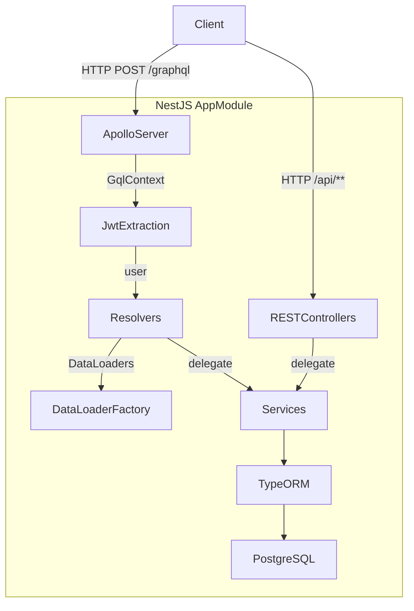

# Design Document: GraphQL API Support

## Overview

This design adds a GraphQL API layer to the existing NestJS backend using `@nestjs/graphql` with Apollo Server (code-first approach). The GraphQL endpoint lives at `/graphql` alongside the existing REST API under `/api`. All existing REST endpoints, Swagger docs, and service logic remain untouched.

The implementation follows the codebase's existing conventions:
- Resolvers live alongside their domain modules (e.g. `savings.resolver.ts` inside `SavingsModule`)
- `GraphQLModule.forRootAsync` is registered once in `AppModule`
- JWT authentication reuses `JwtAuthGuard` and the `CurrentUser` decorator
- DataLoaders are instantiated per-request and attached to `GqlContext`
- Business logic stays in existing services; resolvers are thin delegation layers

### Key Design Decisions

**Code-first over schema-first**: The codebase already uses TypeScript decorators heavily (TypeORM, Swagger). Code-first keeps the single source of truth in TypeScript and auto-generates `src/schema.gql`.

**Resolvers in domain modules, not a separate GraphQL module**: Keeps domain cohesion. Each module exports its resolver alongside its service and controller.

**DataLoader factory per request**: Prevents cross-request cache pollution. The factory is attached to the Apollo context via `context` callback in `GraphQLModule.forRootAsync`.

**Reuse existing services**: Resolvers call the same `SavingsService`, `UserService`, etc. that controllers already use. No business logic duplication.

**`@nestjs/graphql` v12 + `@apollo/server` v4**: Compatible with NestJS v11 (current). Uses `ApolloDriver` from `@nestjs/apollo`.

---

## Architecture



The REST and GraphQL stacks share the same service layer. The only new runtime path is:

```
HTTP Request → Apollo Server → GqlContext (JWT + DataLoaders) → Resolver → Service → DB
```

### Module Registration

`GraphQLModule.forRootAsync` is added to `AppModule.imports`. Each domain module adds its resolver to its own `providers` array and exports it so `AppModule` can pick it up via `autoSchemaFile`.

---

## Components and Interfaces

### 1. GraphQL Module Configuration (`app.module.ts`)

```typescript
GraphQLModule.forRootAsync<ApolloDriverConfig>({
  driver: ApolloDriver,
  inject: [ConfigService],
  useFactory: (config: ConfigService) => ({
    autoSchemaFile: join(process.cwd(), 'src/schema.gql'),
    sortSchema: true,
    playground: config.get('NODE_ENV') === 'development',
    context: ({ req }) => ({
      req,
      loaders: createDataLoaders(/* repositories injected via factory */),
    }),
  }),
})
```

Because `createDataLoaders` needs repository access, the factory uses a `DataLoaderFactory` service injected via `inject`.

### 2. GqlContext Interface

```typescript
export interface GqlContext {
  req: Request;
  user?: User;           // populated after JwtAuthGuard runs
  loaders: DataLoaders;
}

export interface DataLoaders {
  userLoader: DataLoader<string, User>;
  savingsProductLoader: DataLoader<string, SavingsProduct>;
}
```

### 3. DataLoaderFactory Service (`src/common/dataloader/dataloader.factory.ts`)

A request-scoped or factory service that creates fresh DataLoader instances per request. Injected into the GraphQL context factory.

```typescript
@Injectable()
export class DataLoaderFactory {
  constructor(
    @InjectRepository(User) private userRepo: Repository<User>,
    @InjectRepository(SavingsProduct) private productRepo: Repository<SavingsProduct>,
  ) {}

  create(): DataLoaders {
    return {
      userLoader: new DataLoader<string, User>(async (ids) => {
        const users = await this.userRepo.findBy({ id: In([...ids]) });
        const map = new Map(users.map(u => [u.id, u]));
        return ids.map(id => map.get(id) ?? new Error(`User ${id} not found`));
      }),
      savingsProductLoader: new DataLoader<string, SavingsProduct>(async (ids) => {
        const products = await this.productRepo.findBy({ id: In([...ids]) });
        const map = new Map(products.map(p => [p.id, p]));
        return ids.map(id => map.get(id) ?? new Error(`Product ${id} not found`));
      }),
    };
  }
}
```

### 4. JWT Authentication in GraphQL

`JwtAuthGuard` works with GraphQL by overriding `getRequest`:

```typescript
@Injectable()
export class GqlJwtAuthGuard extends JwtAuthGuard {
  getRequest(context: ExecutionContext) {
    const ctx = GqlExecutionContext.create(context);
    return ctx.getContext<GqlContext>().req;
  }
}
```

`CurrentUser` decorator also needs a GraphQL-aware variant:

```typescript
export const GqlCurrentUser = createParamDecorator(
  (_data: unknown, ctx: ExecutionContext) => {
    const gqlCtx = GqlExecutionContext.create(ctx);
    return gqlCtx.getContext<GqlContext>().req.user;
  },
);
```

### 5. Pagination Type

A generic GraphQL pagination wrapper replaces the REST `PageDto<T>`:

```typescript
// src/common/graphql/paginated-result.type.ts
export function PaginatedResult<T>(ItemType: Type<T>) {
  @ObjectType({ isAbstract: true })
  abstract class PaginatedResultClass {
    @Field(() => [ItemType])
    items: T[];

    @Field(() => Int)
    total: number;

    @Field(() => Int)
    page: number;

    @Field(() => Int)
    pageSize: number;
  }
  return PaginatedResultClass;
}
```

Concrete types are created per entity:

```typescript
@ObjectType()
export class PaginatedSavingsProducts extends PaginatedResult(SavingsProductType) {}
```

### 6. Resolver Structure (per domain module)

Each resolver follows this pattern:

```typescript
@Resolver(() => SavingsGoalType)
export class SavingsGoalResolver {
  constructor(private readonly savingsService: SavingsService) {}

  @UseGuards(GqlJwtAuthGuard)
  @Query(() => [SavingsGoalType])
  async myGoals(@GqlCurrentUser() user: User): Promise<SavingsGoal[]> {
    return this.savingsService.findMyGoals(user.id);
  }

  @UseGuards(GqlJwtAuthGuard)
  @Mutation(() => SavingsGoalType)
  async createSavingsGoal(
    @GqlCurrentUser() user: User,
    @Args('input') input: CreateSavingsGoalInput,
  ): Promise<SavingsGoal> {
    return this.savingsService.createGoal(
      user.id, input.goalName, input.targetAmount, input.targetDate, input.metadata,
    );
  }
}
```

### 7. File Layout

```
backend/src/
├── app.module.ts                          ← add GraphQLModule here
├── common/
│   ├── dataloader/
│   │   └── dataloader.factory.ts          ← new
│   ├── decorators/
│   │   └── gql-current-user.decorator.ts  ← new
│   ├── graphql/
│   │   └── paginated-result.type.ts       ← new
│   └── guards/
│       └── gql-jwt-auth.guard.ts          ← new
├── modules/
│   ├── user/
│   │   └── user.resolver.ts               ← new
│   ├── savings/
│   │   ├── savings.resolver.ts            ← new
│   │   └── graphql/
│   │       ├── savings-product.type.ts    ← new
│   │       ├── user-subscription.type.ts  ← new
│   │       ├── savings-goal.type.ts       ← new
│   │       └── savings-goal.input.ts      ← new
│   ├── notifications/
│   │   ├── notifications.resolver.ts      ← new
│   │   └── graphql/
│   │       ├── notification.type.ts       ← new
│   │       └── notification.input.ts      ← new
│   ├── transactions/
│   │   ├── transactions.resolver.ts       ← new
│   │   └── graphql/
│   │       └── transaction.type.ts        ← new
│   ├── claims/
│   │   ├── claims.resolver.ts             ← new
│   │   └── graphql/
│   │       ├── claim.type.ts              ← new
│   │       └── claim.input.ts             ← new
│   ├── disputes/
│   │   ├── disputes.resolver.ts           ← new
│   │   └── graphql/
│   │       ├── dispute.type.ts            ← new
│   │       └── dispute.input.ts           ← new
│   └── governance/
│       ├── governance.resolver.ts         ← new
│       └── graphql/
│           └── governance-proposal.type.ts ← new
└── schema.gql                             ← auto-generated on startup
```

---

## Data Models

### GraphQL ObjectTypes

Each ObjectType mirrors its TypeORM entity, with sensitive fields excluded.

#### UserType
```typescript
@ObjectType('User')
export class UserType {
  @Field(() => ID)   id: string;
  @Field()           email: string;
  @Field({ nullable: true }) name: string;
  @Field({ nullable: true }) bio: string;
  @Field({ nullable: true }) avatarUrl: string;
  @Field()           role: string;
  @Field()           kycStatus: string;
  @Field({ nullable: true }) publicKey: string;
  @Field()           createdAt: Date;
  @Field()           updatedAt: Date;
  // Excluded: password, nonce, kycDocumentUrl, kycRejectionReason,
  //           sweepThreshold, defaultSavingsProductId, autoSweepEnabled
}
```

#### SavingsProductType
```typescript
@ObjectType('SavingsProduct')
export class SavingsProductType {
  @Field(() => ID)   id: string;
  @Field()           name: string;
  @Field()           type: string;           // SavingsProductType enum
  @Field({ nullable: true }) description: string;
  @Field(() => Float) interestRate: number;
  @Field(() => Float) minAmount: number;
  @Field(() => Float) maxAmount: number;
  @Field(() => Int, { nullable: true }) tenureMonths: number;
  @Field({ nullable: true }) contractId: string;
  @Field(() => Float) tvlAmount: number;
  @Field()           isActive: boolean;
  @Field()           riskLevel: string;      // RiskLevel enum
  @Field()           createdAt: Date;
  @Field()           updatedAt: Date;
}
```

#### UserSubscriptionType
```typescript
@ObjectType('UserSubscription')
export class UserSubscriptionType {
  @Field(() => ID)   id: string;
  @Field()           userId: string;
  @Field()           productId: string;
  @Field(() => SavingsProductType) product: SavingsProductType;
  @Field(() => Float) amount: number;
  @Field()           status: string;
  @Field()           startDate: Date;
  @Field({ nullable: true }) endDate: Date;
  @Field()           createdAt: Date;
  @Field()           updatedAt: Date;
}
```

#### SavingsGoalType
```typescript
@ObjectType('SavingsGoal')
export class SavingsGoalType {
  @Field(() => ID)   id: string;
  @Field()           userId: string;
  @Field()           goalName: string;
  @Field(() => Float) targetAmount: number;
  @Field()           targetDate: Date;
  @Field()           status: string;
  @Field({ nullable: true }) metadata: GraphQLJSON;
  @Field()           createdAt: Date;
  @Field()           updatedAt: Date;
}
```

#### NotificationType
```typescript
@ObjectType('Notification')
export class NotificationType {
  @Field(() => ID)   id: string;
  @Field()           userId: string;
  @Field()           type: string;
  @Field()           title: string;
  @Field()           message: string;
  @Field()           read: boolean;
  @Field({ nullable: true }) metadata: GraphQLJSON;
  @Field()           createdAt: Date;
  @Field()           updatedAt: Date;
}
```

#### NotificationPreferenceType
```typescript
@ObjectType('NotificationPreference')
export class NotificationPreferenceType {
  @Field(() => ID)   id: string;
  @Field()           userId: string;
  @Field()           emailNotifications: boolean;
  @Field()           inAppNotifications: boolean;
  @Field()           sweepNotifications: boolean;
  @Field()           claimNotifications: boolean;
  @Field()           yieldNotifications: boolean;
  @Field()           createdAt: Date;
  @Field()           updatedAt: Date;
}
```

#### TransactionType
```typescript
@ObjectType('Transaction')
export class TransactionType {
  @Field(() => ID)   id: string;
  @Field()           userId: string;
  @Field()           type: string;
  @Field()           amount: string;
  @Field({ nullable: true }) txHash: string;
  @Field()           status: string;
  @Field({ nullable: true }) publicKey: string;
  @Field({ nullable: true }) poolId: string;
  @Field()           createdAt: Date;
}
```

#### ClaimType (MedicalClaim)
```typescript
@ObjectType('Claim')
export class ClaimType {
  @Field(() => ID)   id: string;
  @Field()           patientName: string;
  @Field()           patientId: string;
  @Field()           hospitalName: string;
  @Field()           hospitalId: string;
  @Field(() => [String]) diagnosisCodes: string[];
  @Field(() => Float) claimAmount: number;
  @Field()           status: string;
  @Field({ nullable: true }) notes: string;
  @Field({ nullable: true }) blockchainTxHash: string;
  @Field()           createdAt: Date;
  @Field()           updatedAt: Date;
}
```

#### DisputeType
```typescript
@ObjectType('Dispute')
export class DisputeType {
  @Field(() => ID)   id: string;
  @Field()           claimId: string;
  @Field()           disputedBy: string;
  @Field()           reason: string;
  @Field()           status: string;
  @Field()           createdAt: Date;
  @Field()           updatedAt: Date;
}
```

#### GovernanceProposalType
```typescript
@ObjectType('GovernanceProposal')
export class GovernanceProposalType {
  @Field(() => ID)   id: string;
  @Field(() => Int)  onChainId: number;
  @Field()           title: string;
  @Field({ nullable: true }) description: string;
  @Field()           category: string;
  @Field()           status: string;
  @Field({ nullable: true }) proposer: string;
  @Field()           createdAt: Date;
  @Field()           updatedAt: Date;
}
```

### InputTypes

```typescript
@InputType()
export class CreateSavingsGoalInput {
  @Field() goalName: string;
  @Field(() => Float) targetAmount: number;
  @Field() targetDate: Date;
  @Field({ nullable: true }) metadata?: Record<string, unknown>;
}

@InputType()
export class UpdateSavingsGoalInput {
  @Field({ nullable: true }) goalName?: string;
  @Field(() => Float, { nullable: true }) targetAmount?: number;
  @Field({ nullable: true }) targetDate?: Date;
  @Field({ nullable: true }) status?: string;
}

@InputType()
export class UpdateNotificationPreferenceInput {
  @Field({ nullable: true }) emailNotifications?: boolean;
  @Field({ nullable: true }) inAppNotifications?: boolean;
  @Field({ nullable: true }) sweepNotifications?: boolean;
  @Field({ nullable: true }) claimNotifications?: boolean;
  @Field({ nullable: true }) yieldNotifications?: boolean;
}

@InputType()
export class CreateClaimInput {
  @Field() patientName: string;
  @Field() patientId: string;
  @Field() patientDateOfBirth: Date;
  @Field() hospitalName: string;
  @Field() hospitalId: string;
  @Field(() => [String]) diagnosisCodes: string[];
  @Field(() => Float) claimAmount: number;
  @Field({ nullable: true }) notes?: string;
}

@InputType()
export class CreateDisputeInput {
  @Field() claimId: string;
  @Field() reason: string;
}
```

### Pagination Args

```typescript
@ArgsType()
export class PaginationArgs {
  @Field(() => Int, { defaultValue: 1 })
  page: number = 1;

  @Field(() => Int, { defaultValue: 20 })
  pageSize: number = 20;
}
```

---

## Correctness Properties

*A property is a characteristic or behavior that should hold true across all valid executions of a system — essentially, a formal statement about what the system should do. Properties serve as the bridge between human-readable specifications and machine-verifiable correctness guarantees.*

### Property 1: Playground gating by environment

*For any* server configuration, the GraphQL Playground endpoint should be accessible if and only if `NODE_ENV` is `'development'`.

**Validates: Requirements 1.3, 1.4**

---

### Property 2: Sensitive fields excluded from User type

*For any* authenticated user, the GraphQL `me` query response should never contain the fields `password`, `nonce`, `kycRejectionReason`, `sweepThreshold`, `defaultSavingsProductId`, or `autoSweepEnabled`.

**Validates: Requirements 2.2**

---

### Property 3: Nested relations use ObjectType references, not raw FKs

*For any* `UserSubscription` returned by `mySubscriptions`, the `product` field should be a fully resolved `SavingsProduct` object, not a raw UUID scalar.

**Validates: Requirements 2.3**

---

### Property 4: Paginated list invariants

*For any* paginated query (`savingsProducts`, `myNotifications`, `myTransactions`, `governanceProposals`) with valid `page` and `pageSize` arguments, the response should satisfy: `items.length <= pageSize` and `total >= items.length`.

**Validates: Requirements 2.5, 3.2, 3.6, 3.7, 3.10**

---

### Property 5: Authenticated queries reject unauthenticated requests

*For any* of the protected queries (`me`, `mySubscriptions`, `myGoals`, `myNotifications`, `myTransactions`, `myClaims`, `myDisputes`) and any request without a valid JWT, the server should return an `UNAUTHENTICATED` error and no data.

**Validates: Requirements 6.3, 6.5**

---

### Property 6: Public queries accessible without JWT

*For any* call to `savingsProducts`, `savingsProduct`, or `governanceProposals` without an `Authorization` header, the server should return data successfully (no auth error).

**Validates: Requirements 6.6, 6.7**

---

### Property 7: DataLoader batches per-request, not cross-request

*For any* two concurrent requests each resolving N user IDs, the total number of SQL queries issued for user lookups should equal 2 (one batch per request), not 2N.

**Validates: Requirements 5.1, 5.2, 5.5**

---

### Property 8: Mutation ownership enforcement

*For any* mutation targeting a resource (SavingsGoal, Notification) and any authenticated user who does not own that resource, the mutation should return a `ForbiddenError` and leave the resource unchanged.

**Validates: Requirements 4.8**

---

### Property 9: Business rule violations produce UserInputError

*For any* mutation input that violates a business rule (e.g. `targetDate` in the past for `createSavingsGoal`), the resolver should throw a `UserInputError` with a non-empty message, and no resource should be created or modified.

**Validates: Requirements 4.7**

---

### Property 10: REST API unaffected by GraphQL errors

*For any* GraphQL request that results in an error (resolver throws, schema validation fails, auth fails), all REST endpoints should continue to respond correctly with their expected status codes and response shapes.

**Validates: Requirements 7.1, 7.2, 7.4**

---

## Error Handling

### GraphQL Error Mapping

NestJS exceptions from the service layer are mapped to Apollo error types:

| NestJS Exception | GraphQL Error |
|---|---|
| `NotFoundException` | `ApolloError` with code `NOT_FOUND` |
| `BadRequestException` | `UserInputError` (code `BAD_USER_INPUT`) |
| `ForbiddenException` | `ForbiddenError` (code `FORBIDDEN`) |
| `UnauthorizedException` | `AuthenticationError` (code `UNAUTHENTICATED`) |

A global `GqlExceptionFilter` (implementing `ExceptionFilter`) catches NestJS HTTP exceptions thrown inside resolvers and re-throws them as the appropriate Apollo error type. This keeps resolver code clean — resolvers just call services and let exceptions propagate.

```typescript
@Catch(HttpException)
export class GqlHttpExceptionFilter implements ExceptionFilter {
  catch(exception: HttpException, host: ArgumentsHost) {
    const status = exception.getStatus();
    const message = exception.message;
    if (status === 403) throw new ForbiddenError(message);
    if (status === 401) throw new AuthenticationError(message);
    if (status === 400) throw new UserInputError(message);
    throw new ApolloError(message, 'INTERNAL_SERVER_ERROR');
  }
}
```

### Validation

`class-validator` decorators on `InputType` classes are enforced by NestJS's global `ValidationPipe`. Invalid inputs are rejected before reaching the resolver, producing a `UserInputError` automatically.

### DataLoader Errors

If a DataLoader batch function cannot find an entity for a given ID, it returns an `Error` instance for that position (not `null`). This causes the field to resolve as `null` with an error entry in the GraphQL `errors` array, rather than crashing the entire request.

---

## Testing Strategy

### Dual Testing Approach

Both unit tests and property-based tests are required. They are complementary:
- Unit tests verify specific examples, integration points, and error conditions
- Property tests verify universal correctness across randomized inputs

### Unit Tests

Each resolver gets a `*.resolver.spec.ts` file using `@nestjs/testing` with mocked services:

```typescript
// savings.resolver.spec.ts
describe('SavingsGoalResolver', () => {
  it('createSavingsGoal delegates to SavingsService.createGoal', async () => { ... });
  it('updateSavingsGoal throws ForbiddenError for non-owner', async () => { ... });
  it('myGoals requires authentication', async () => { ... });
});
```

Integration tests use `supertest` against a test NestJS app with an in-memory SQLite or test PostgreSQL database:

```typescript
// graphql.e2e-spec.ts
it('POST /graphql - me query returns user without password field', async () => { ... });
it('POST /graphql - savingsProducts is publicly accessible', async () => { ... });
it('POST /graphql - myGoals returns 401 without JWT', async () => { ... });
```

### Property-Based Tests

Property-based testing uses **`fast-check`** (TypeScript-native, no extra runtime needed).

Each property test runs a minimum of **100 iterations**.

Each test is tagged with a comment referencing the design property:
```
// Feature: graphql-api-support, Property N: <property_text>
```

**Property test examples:**

```typescript
// Feature: graphql-api-support, Property 4: Paginated list invariants
it('paginated results satisfy items.length <= pageSize and total >= items.length', () => {
  fc.assert(fc.asyncProperty(
    fc.integer({ min: 1, max: 10 }),   // page
    fc.integer({ min: 1, max: 50 }),   // pageSize
    async (page, pageSize) => {
      const result = await resolver.savingsProducts({ page, pageSize });
      expect(result.items.length).toBeLessThanOrEqual(pageSize);
      expect(result.total).toBeGreaterThanOrEqual(result.items.length);
    }
  ), { numRuns: 100 });
});

// Feature: graphql-api-support, Property 2: Sensitive fields excluded from User type
it('me query never exposes sensitive fields', () => {
  fc.assert(fc.asyncProperty(
    fc.record({ id: fc.uuid(), email: fc.emailAddress(), password: fc.string() }),
    async (userData) => {
      const user = await seedUser(userData);
      const result = await resolver.me(user);
      expect(result).not.toHaveProperty('password');
      expect(result).not.toHaveProperty('nonce');
      expect(result).not.toHaveProperty('kycRejectionReason');
    }
  ), { numRuns: 100 });
});

// Feature: graphql-api-support, Property 9: Business rule violations produce UserInputError
it('createSavingsGoal with past targetDate always throws UserInputError', () => {
  fc.assert(fc.asyncProperty(
    fc.date({ max: new Date() }),   // any date in the past
    async (pastDate) => {
      await expect(
        resolver.createSavingsGoal(mockUser, { goalName: 'Test', targetAmount: 100, targetDate: pastDate })
      ).rejects.toThrow(UserInputError);
    }
  ), { numRuns: 100 });
});

// Feature: graphql-api-support, Property 8: Mutation ownership enforcement
it('updateSavingsGoal by non-owner always throws ForbiddenError', () => {
  fc.assert(fc.asyncProperty(
    fc.uuid(),   // random goal owner ID
    fc.uuid(),   // random requester ID (different)
    async (ownerId, requesterId) => {
      fc.pre(ownerId !== requesterId);
      const goal = await seedGoal({ userId: ownerId });
      await expect(
        resolver.updateSavingsGoal({ id: requesterId } as User, goal.id, {})
      ).rejects.toThrow(ForbiddenError);
    }
  ), { numRuns: 100 });
});
```

### Required Packages

```bash
pnpm add @nestjs/graphql @nestjs/apollo @apollo/server graphql dataloader graphql-scalars
pnpm add -D fast-check @types/dataloader
```
