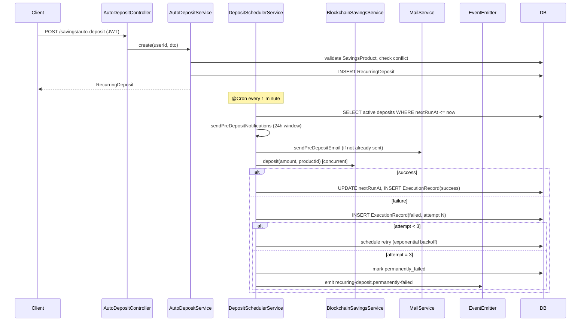

# Design Document: Savings Auto-Deposit (Recurring Deposits)

## Overview

This document describes the technical design for the Savings Auto-Deposit feature, which allows users to configure automatic recurring deposits to their savings accounts on a daily, weekly, or monthly schedule.

The feature is implemented as a standalone `AutoDepositModule` at `backend/src/modules/auto-deposit/`. It introduces two new database entities (`RecurringDeposit`, `DepositExecutionRecord`), a cron-based scheduler, retry logic with exponential backoff, pre-deposit email notifications, and an admin analytics endpoint. The module integrates with the existing `SavingsModule` (for product validation), `BlockchainSavingsService` (for executing deposits), and `MailService` (for notifications).

`ScheduleModule.forRoot()` must be added to `AppModule` if not already registered.

---

## Architecture



---

## Components and Interfaces

### New Module: `AutoDepositModule`

**Location:** `backend/src/modules/auto-deposit/`

| File | Purpose |
|---|---|
| `auto-deposit.module.ts` | Module definition; imports TypeORM entities, MailModule, BlockchainModule, SavingsModule |
| `auto-deposit.controller.ts` | REST endpoints for CRUD, pause/resume, analytics |
| `auto-deposit.service.ts` | Business logic: create, read, pause, resume, cancel, analytics |
| `deposit-scheduler.service.ts` | `@Cron`-based scheduler: evaluates due deposits, sends notifications, executes deposits, handles retries |
| `entities/recurring-deposit.entity.ts` | `RecurringDeposit` TypeORM entity |
| `entities/deposit-execution-record.entity.ts` | `DepositExecutionRecord` TypeORM entity |
| `dto/create-recurring-deposit.dto.ts` | Request DTO for POST |
| `dto/recurring-deposit-response.dto.ts` | Response DTO |
| `dto/analytics-response.dto.ts` | Analytics response DTO |

### Modified Files

| File | Change |
|---|---|
| `app.module.ts` | Add `ScheduleModule.forRoot()` and `AutoDepositModule` |
| `mail/mail.service.ts` | Add `sendPreDepositEmail` method |

### Controller Endpoints

```typescript
@ApiTags('auto-deposit')
@Controller('savings/auto-deposit')
export class AutoDepositController {
  // GET  /savings/auto-deposit/analytics  — admin only
  // GET  /savings/auto-deposit            — list user's deposits
  // GET  /savings/auto-deposit/:id        — get single deposit
  // POST /savings/auto-deposit            — create
  // PATCH /savings/auto-deposit/:id/pause
  // PATCH /savings/auto-deposit/:id/resume
  // DELETE /savings/auto-deposit/:id
}
```

Note: the `/analytics` route must be declared before `/:id` in the controller to avoid NestJS routing ambiguity.

---

## Data Models

### Entity: `RecurringDeposit`

```typescript
@Entity('recurring_deposits')
export class RecurringDeposit {
  @PrimaryGeneratedColumn('uuid')
  id: string;

  @Column('uuid')
  userId: string;

  @Column('uuid')
  productId: string;

  @Column('decimal', { precision: 14, scale: 2 })
  amount: number;

  @Column({ type: 'enum', enum: DepositSchedule })
  schedule: DepositSchedule;  // 'daily' | 'weekly' | 'monthly'

  @Column({ type: 'enum', enum: DepositStatus, default: DepositStatus.ACTIVE })
  status: DepositStatus;  // 'active' | 'paused' | 'cancelled'

  @Column({ type: 'timestamptz' })
  nextRunAt: Date;

  @Column({ type: 'boolean', default: false })
  notificationSentForCurrentRun: boolean;  // deduplication flag for pre-deposit email

  @CreateDateColumn()
  createdAt: Date;

  @UpdateDateColumn()
  updatedAt: Date;
}
```

Indexes: `(userId, productId, status)` for conflict checks; `(status, nextRunAt)` for scheduler queries.

### Entity: `DepositExecutionRecord`

```typescript
@Entity('deposit_execution_records')
export class DepositExecutionRecord {
  @PrimaryGeneratedColumn('uuid')
  id: string;

  @Column('uuid')
  recurringDepositId: string;

  @Column({ type: 'enum', enum: ExecutionStatus })
  status: ExecutionStatus;  // 'success' | 'failed' | 'permanently_failed'

  @Column('int', { default: 1 })
  attemptNumber: number;

  @Column({ type: 'text', nullable: true })
  errorMessage: string | null;

  @Column({ type: 'timestamptz' })
  executedAt: Date;

  @CreateDateColumn()
  createdAt: Date;
}
```

Index: `(recurringDepositId, executedAt DESC)` for retry count lookups.

### Enums

```typescript
export enum DepositSchedule {
  DAILY = 'daily',
  WEEKLY = 'weekly',
  MONTHLY = 'monthly',
}

export enum DepositStatus {
  ACTIVE = 'active',
  PAUSED = 'paused',
  CANCELLED = 'cancelled',
}

export enum ExecutionStatus {
  SUCCESS = 'success',
  FAILED = 'failed',
  PERMANENTLY_FAILED = 'permanently_failed',
}
```

### Request DTO: `CreateRecurringDepositDto`

```typescript
class CreateRecurringDepositDto {
  @IsUUID()
  productId: string;

  @IsNumber()
  @Min(0)
  amount: number;

  @IsEnum(DepositSchedule)
  schedule: DepositSchedule;
}
```

### `nextRunAt` Computation

`nextRunAt` is computed from the current UTC time at creation and on each successful execution or resume:

| Schedule | Next run |
|---|---|
| `daily` | `now + 1 day` |
| `weekly` | `now + 7 days` |
| `monthly` | `now + 1 calendar month` (using `date-fns addMonths`) |

### Migration

A new TypeORM migration creates `recurring_deposits` and `deposit_execution_records` tables with the indexes described above.

---

## Correctness Properties

*A property is a characteristic or behavior that should hold true across all valid executions of a system — essentially, a formal statement about what the system should do. Properties serve as the bridge between human-readable specifications and machine-verifiable correctness guarantees.*

### Property 1: Created deposit contains all required fields

*For any* valid creation request (valid productId, amount ≥ minAmount, schedule), the returned `RecurringDeposit` should contain `userId`, `productId`, `amount`, `schedule`, `status = active`, a non-null `nextRunAt` in the future, `createdAt`, and `updatedAt`.

**Validates: Requirements 1.1, 1.2**

---

### Property 2: Amount below minAmount is rejected with 422

*For any* amount in the range `[0, product.minAmount)`, a creation request should be rejected with HTTP 422 Unprocessable Entity.

**Validates: Requirements 1.3**

---

### Property 3: Scheduler only processes active deposits

*For any* `RecurringDeposit` with `status = paused` or `status = cancelled`, the scheduler's due-deposit query should never return that record, regardless of its `nextRunAt` value.

**Validates: Requirements 5.5, 7.3**

---

### Property 4: nextRunAt advances correctly on success

*For any* `RecurringDeposit` with schedule `S` and `nextRunAt = T`, after a successful execution the new `nextRunAt` should equal `T + interval(S)` where `interval(daily) = 1 day`, `interval(weekly) = 7 days`, `interval(monthly) = 1 calendar month`.

**Validates: Requirements 2.3**

---

### Property 5: nextRunAt does not advance on failed attempt

*For any* `RecurringDeposit` with `nextRunAt = T`, after a failed deposit attempt (attempt number < 3), `nextRunAt` should remain equal to `T`.

**Validates: Requirements 3.5**

---

### Property 6: Execution record is created for every attempt

*For any* deposit execution attempt (success or failure), a `DepositExecutionRecord` should be created with the correct `status`, `attemptNumber`, and `executedAt` timestamp.

**Validates: Requirements 2.4, 3.4**

---

### Property 7: Retry backoff delay is exponential

*For any* failed deposit attempt number `n` (1 ≤ n ≤ 3), the retry delay should equal `5 * 2^(n-1)` minutes (i.e., 5 min, 10 min, 20 min).

**Validates: Requirements 3.1**

---

### Property 8: Pre-deposit notification is sent at most once per occurrence

*For any* `RecurringDeposit` whose `nextRunAt` is within 24 hours and `notificationSentForCurrentRun = false`, the scheduler should send exactly one pre-deposit email and set `notificationSentForCurrentRun = true`. Subsequent scheduler ticks for the same occurrence should not send another email.

**Validates: Requirements 4.1, 4.3**

---

### Property 9: Pre-deposit email contains required fields

*For any* pre-deposit notification, the email context passed to `MailService` should include the deposit `amount`, the `SavingsProduct.name`, and the `nextRunAt` timestamp in UTC.

**Validates: Requirements 4.2**

---

### Property 10: Ownership is enforced on all mutating and read endpoints

*For any* `RecurringDeposit` belonging to user A, a request from user B (different authenticated user) to pause, resume, cancel, or retrieve that deposit should receive HTTP 403 Forbidden.

**Validates: Requirements 5.3, 6.3, 7.2**

---

### Property 11: Pause/resume is a round-trip state transition

*For any* `active` `RecurringDeposit`, pausing it should set `status = paused`; subsequently resuming it should set `status = active` and recompute `nextRunAt` to a time in the future relative to the resume timestamp.

**Validates: Requirements 5.1, 5.2**

---

### Property 12: List endpoint returns only the authenticated user's deposits

*For any* user, `GET /savings/auto-deposit` should return only `RecurringDeposit` records where `userId` matches the authenticated user's ID — never records belonging to other users.

**Validates: Requirements 6.1**

---

## Error Handling

| Scenario | HTTP Status | Behavior |
|---|---|---|
| Missing or invalid JWT | 401 | `JwtAuthGuard` rejects before reaching service |
| `productId` not found or inactive | 404 | `AutoDepositService` throws `NotFoundException` |
| `amount` < `product.minAmount` | 422 | `AutoDepositService` throws `UnprocessableEntityException` |
| Duplicate active deposit for same product | 409 | `AutoDepositService` throws `ConflictException` |
| Deposit ID not found | 404 | `AutoDepositService` throws `NotFoundException` |
| Deposit belongs to different user | 403 | `AutoDepositService` throws `ForbiddenException` |
| Non-admin accesses analytics | 403 | `RolesGuard` rejects |
| `BlockchainSavingsService` throws during execution | — | Retry handler records failure; after 3 attempts emits `recurring-deposit.permanently-failed` event |
| `MailService` throws during pre-deposit notification | — | Logged and swallowed; deposit execution proceeds normally |
| Scheduler cron overlap (previous tick still running) | — | `@Cron` with `{ name }` + distributed lock (Redis `SET NX EX`) prevents concurrent scheduler runs |

---

## Testing Strategy

### Unit Tests

Focus on isolated, deterministic behavior:

- `AutoDepositService`: creation validation (minAmount, 404, 409), pause/resume state transitions, ownership checks, cancel logic.
- `DepositSchedulerService`: due-deposit query filter (only active, only `nextRunAt <= now`), `nextRunAt` computation for each schedule type, retry backoff calculation, notification deduplication flag logic, `permanently_failed` event emission after 3 failures.
- `nextRunAt` helper: verify correct date arithmetic for daily/weekly/monthly schedules including month-boundary edge cases.
- DTO validation: `class-validator` rejects missing fields, invalid enum values, negative amounts.

### Property-Based Tests

Use **`fast-check`** (consistent with the existing `savings-product-comparison` spec). Each property test runs a minimum of **100 iterations**.

Tag format: `// Feature: savings-auto-deposit, Property {N}: {property_text}`

| Property | Test description |
|---|---|
| P1 — Created deposit fields | Generate valid (schedule, amount ≥ minAmount, productId) tuples; assert all required fields present and `status = active`, `nextRunAt > now` |
| P2 — Amount below minAmount rejected | Generate amounts in `[0, minAmount)`; assert HTTP 422 |
| P3 — Scheduler filters non-active | Generate deposits with `status = paused` or `cancelled`; assert scheduler query returns empty set |
| P4 — nextRunAt advances on success | Generate schedule types and base timestamps; assert new `nextRunAt = base + interval(schedule)` |
| P5 — nextRunAt unchanged on failure | Generate failed attempts with attempt < 3; assert `nextRunAt` unchanged |
| P6 — Execution record created per attempt | Generate success and failure scenarios; assert record exists with correct fields |
| P7 — Exponential backoff | Generate attempt numbers 1–3; assert retry delay = `5 * 2^(n-1)` minutes |
| P8 — Notification at-most-once | Generate deposits with `nextRunAt` within 24h; run scheduler tick twice; assert email sent exactly once |
| P9 — Email context fields | Generate deposits with random amounts and product names; assert email context contains all three required fields |
| P10 — Ownership enforcement | Generate two distinct user IDs and a deposit owned by user A; assert user B gets 403 on all endpoints |
| P11 — Pause/resume round trip | Generate active deposits; pause then resume; assert `status = active` and `nextRunAt > resumeTime` |
| P12 — List isolation | Generate deposits for multiple users; assert list response for user A contains no deposits owned by user B |

### Integration / E2E Tests

- `POST /savings/auto-deposit` without JWT → 401
- `POST /savings/auto-deposit` with inactive product → 404
- `POST /savings/auto-deposit` duplicate active deposit → 409
- `GET /savings/auto-deposit/analytics` as non-admin → 403
- `GET /savings/auto-deposit/analytics` as admin with seeded data → correct aggregate counts
- `DELETE /savings/auto-deposit/:id` → 204, subsequent scheduler tick skips the record
- Mail failure during notification → deposit execution still proceeds (no 500)
