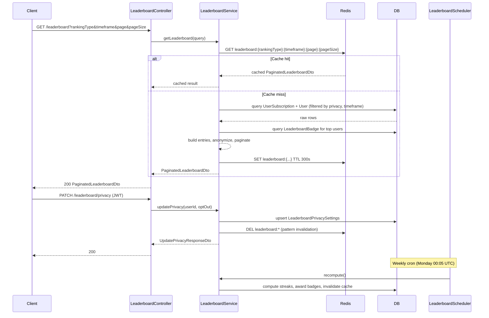

# Design Document: Savings Leaderboard API

## Overview

This document describes the technical design for the Savings Leaderboard feature, implemented as a new `LeaderboardModule` at `backend/src/modules/leaderboard/`. The feature exposes a REST API that ranks users by savings metrics, supports privacy opt-out, anonymized display names, weekly and all-time timeframes, Redis caching, pagination, badge awards for top savers, and a scheduled/admin-triggered recomputation cycle.

The design follows existing NestJS patterns in the codebase: TypeORM repositories, `CACHE_MANAGER` injection, `JwtAuthGuard` + `CurrentUser`, `RolesGuard` + `Roles` for admin endpoints, and `@nestjs/schedule` for cron jobs.

---

## Architecture

The `LeaderboardModule` is self-contained. A single `LeaderboardService` owns all business logic. A `LeaderboardScheduler` handles the weekly cron job. The controller exposes all public and admin endpoints.



---

## Components and Interfaces

### Module Structure

```
backend/src/modules/leaderboard/
├── dto/
│   ├── leaderboard-query.dto.ts
│   ├── leaderboard-entry.dto.ts
│   ├── paginated-leaderboard.dto.ts
│   ├── update-privacy.dto.ts
│   └── recompute-response.dto.ts
├── entities/
│   ├── leaderboard-privacy-settings.entity.ts
│   ├── leaderboard-badge.entity.ts
│   └── user-savings-streak.entity.ts
├── leaderboard.controller.ts
├── leaderboard.service.ts
├── leaderboard.scheduler.ts
└── leaderboard.module.ts
```

### Controller Endpoints

| Method | Path | Guard | Description |
|---|---|---|---|
| `GET` | `/leaderboard` | public | Paginated ranked list |
| `PATCH` | `/leaderboard/privacy` | `JwtAuthGuard` | Update opt-out preference |
| `GET` | `/leaderboard/badges/me` | `JwtAuthGuard` | Current user's badges |
| `POST` | `/leaderboard/recompute` | `JwtAuthGuard` + `RolesGuard(ADMIN)` | Manual recomputation |

### Key Service Methods

```typescript
// Returns paginated leaderboard, cache-first
getLeaderboard(query: LeaderboardQueryDto): Promise<PaginatedLeaderboardDto>

// Upserts privacy settings, invalidates all leaderboard cache keys
updatePrivacy(userId: string, optOut: boolean): Promise<UpdatePrivacyResponseDto>

// Returns all badges for the current user
getMyBadges(userId: string): Promise<LeaderboardBadgeDto[]>

// Full recomputation: streaks → rankings → badge diff → cache invalidation
recompute(): Promise<RecomputeResponseDto>

// Private helpers
buildRankingQuery(rankingType, timeframe): SelectQueryBuilder
computeStreaks(): Promise<void>
awardBadges(rankingType, timeframe, topThree): Promise<void>
anonymize(user: { publicKey?: string; id: string }): string
invalidateLeaderboardCache(): Promise<void>
```

---

## Data Models

### Entity: `LeaderboardPrivacySettings`

```typescript
@Entity('leaderboard_privacy_settings')
class LeaderboardPrivacySettings {
  @PrimaryGeneratedColumn('uuid')
  id: string;

  @Column('uuid', { unique: true })
  userId: string;

  @Column({ type: 'boolean', default: false })
  optOut: boolean;

  @CreateDateColumn()
  createdAt: Date;

  @UpdateDateColumn()
  updatedAt: Date;
}
```

Index: unique on `userId`.

### Entity: `LeaderboardBadge`

```typescript
export enum BadgeType {
  GOLD_SAVER = 'gold_saver',
  SILVER_SAVER = 'silver_saver',
  BRONZE_SAVER = 'bronze_saver',
}

@Entity('leaderboard_badges')
class LeaderboardBadge {
  @PrimaryGeneratedColumn('uuid')
  id: string;

  @Column('uuid')
  userId: string;

  @Column({ type: 'varchar' })
  badgeType: BadgeType;

  @Column({ type: 'varchar' })
  rankingType: RankingType;

  @Column({ type: 'varchar' })
  timeframe: Timeframe;

  @CreateDateColumn()
  awardedAt: Date;
}
```

Index: `(userId, rankingType, timeframe, badgeType)` — allows querying a user's badges per context.

### Entity: `UserSavingsStreak`

```typescript
@Entity('user_savings_streaks')
class UserSavingsStreak {
  @PrimaryGeneratedColumn('uuid')
  id: string;

  @Column('uuid', { unique: true })
  userId: string;

  @Column({ type: 'int', default: 0 })
  streakWeeks: number;

  @UpdateDateColumn()
  updatedAt: Date;
}
```

Index: unique on `userId`.

### Enums

```typescript
export enum RankingType {
  TOTAL_SAVINGS = 'total_savings',
  INTEREST_EARNED = 'interest_earned',
  SAVINGS_STREAK = 'savings_streak',
}

export enum Timeframe {
  ALL_TIME = 'all_time',
  WEEKLY = 'weekly',
}
```

### DTOs

```typescript
// Request
class LeaderboardQueryDto {
  rankingType?: RankingType;   // default: total_savings
  timeframe?: Timeframe;       // default: all_time
  page?: number;               // @Min(1), default: 1
  pageSize?: number;           // @Min(1) @Max(100), default: 20
}

// Single entry in the response
class LeaderboardEntryDto {
  rank: number;
  anonymizedUsername: string;  // "User****{last4}"
  score: number;               // sum of amounts, interest, or streak count
  badges: LeaderboardBadgeDto[];
}

class LeaderboardBadgeDto {
  id: string;
  badgeType: BadgeType;
  rankingType: RankingType;
  timeframe: Timeframe;
  awardedAt: string;           // ISO 8601
}

// Paginated wrapper
class PaginatedLeaderboardDto {
  data: LeaderboardEntryDto[];
  total: number;
  page: number;
  pageSize: number;
  totalPages: number;
}

// PATCH /leaderboard/privacy request
class UpdatePrivacyDto {
  optOut: boolean;             // @IsBoolean()
}

// PATCH /leaderboard/privacy response
class UpdatePrivacyResponseDto {
  optOut: boolean;
  updatedAt: string;
}

// POST /leaderboard/recompute response
class RecomputeResponseDto {
  message: string;
  recomputedAt: string;        // ISO 8601
}
```

### Cache Key Scheme

| Entry | Key pattern | TTL |
|---|---|---|
| Leaderboard page | `leaderboard:{rankingType}:{timeframe}:{page}:{pageSize}` | 300 s |

Cache invalidation on privacy change and recomputation uses a key-scan pattern: the service calls `cacheManager.store.keys('leaderboard:*')` (Redis `KEYS` pattern) and deletes each matching key. For production scale a Redis `SCAN`-based approach is preferred; the implementation should use the store's native scan if available, falling back to `KEYS` for simplicity.

---

## Ranking Query Design

### `total_savings` (all_time)

```sql
SELECT u.id, u.public_key, SUM(us.amount) AS score
FROM users u
JOIN user_subscriptions us ON us.user_id = u.id
  AND us.status = 'ACTIVE'
LEFT JOIN leaderboard_privacy_settings lps ON lps.user_id = u.id
WHERE (lps.opt_out IS NULL OR lps.opt_out = false)
GROUP BY u.id, u.public_key
ORDER BY score DESC
```

### `total_savings` (weekly)

Same as above with an additional filter:

```sql
AND us.start_date >= :weekStart AND us.start_date <= :weekEnd
```

Where `weekStart` = Monday 00:00 UTC and `weekEnd` = Sunday 23:59:59 UTC of the current ISO week.

### `interest_earned`

Replace `SUM(us.amount)` with `SUM(us.total_interest_earned)`. The `weekly` variant applies the same `startDate` window.

### `savings_streak`

```sql
SELECT u.id, u.public_key, COALESCE(uss.streak_weeks, 0) AS score
FROM users u
LEFT JOIN user_savings_streaks uss ON uss.user_id = u.id
LEFT JOIN leaderboard_privacy_settings lps ON lps.user_id = u.id
WHERE (lps.opt_out IS NULL OR lps.opt_out = false)
ORDER BY score DESC
```

Streak is pre-computed and stored in `UserSavingsStreak`; the weekly timeframe for streak uses the same stored value (streak is inherently a rolling weekly metric).

### Anonymization Logic

```typescript
function anonymize(user: { publicKey?: string | null; id: string }): string {
  const source =
    user.publicKey && user.publicKey.length >= 4
      ? user.publicKey
      : user.id;
  return `User****${source.slice(-4)}`;
}
```

### Streak Computation

Run during `recompute()`:

1. For each user, fetch all distinct ISO week numbers where they had at least one `UserSubscription` with `status = 'ACTIVE'`.
2. Starting from the current week, walk backwards counting consecutive weeks with an active subscription.
3. Stop at the first gap. The count is the streak.
4. Upsert into `UserSavingsStreak`.

```typescript
// Pseudocode
const currentWeek = getISOWeek(new Date());
for (const userId of allUserIds) {
  const activeWeeks = await getActiveWeeksForUser(userId); // Set<isoWeekKey>
  let streak = 0;
  let week = currentWeek;
  while (activeWeeks.has(week)) {
    streak++;
    week = previousWeek(week);
  }
  await upsertStreak(userId, streak);
}
```

### Badge Award Logic

Run during `recompute()` for each `(rankingType, timeframe)` combination:

1. Compute full ranking (no pagination).
2. Extract top-3 users.
3. For each rank position (1 → gold, 2 → silver, 3 → bronze):
   - Query the most recent badge of that `(badgeType, rankingType, timeframe)` combination.
   - If the current rank holder differs from the previous badge holder, insert a new `LeaderboardBadge` record for the new holder.
4. The old badge record is retained (historical record); only new awards are inserted.

---

## Correctness Properties


*A property is a characteristic or behavior that should hold true across all valid executions of a system — essentially, a formal statement about what the system should do. Properties serve as the bridge between human-readable specifications and machine-verifiable correctness guarantees.*

### Property 1: Leaderboard entries are ordered descending by score

*For any* valid leaderboard query (any `rankingType`, `timeframe`, `page`, `pageSize`), the `score` values in the returned `data` array should be in non-increasing order.

**Validates: Requirements 1.1, 1.4**

---

### Property 2: `total_savings` score equals sum of active subscription amounts

*For any* user with a known set of `ACTIVE` `UserSubscription` records, their `score` in a `total_savings` leaderboard should equal the arithmetic sum of those subscriptions' `amount` fields.

**Validates: Requirements 1.2**

---

### Property 3: `interest_earned` score equals sum of `totalInterestEarned`

*For any* user with a known set of `UserSubscription` records, their `score` in an `interest_earned` leaderboard should equal the arithmetic sum of those subscriptions' `totalInterestEarned` fields.

**Validates: Requirements 1.3**

---

### Property 4: Weekly timeframe excludes out-of-week subscriptions

*For any* `UserSubscription` whose `startDate` falls outside the current ISO calendar week (Monday 00:00 UTC – Sunday 23:59:59 UTC), that subscription should contribute zero to the user's score in a `weekly` leaderboard query.

**Validates: Requirements 2.2**

---

### Property 5: Invalid query parameters return HTTP 400

*For any* request to `GET /leaderboard` where `rankingType` is not one of `{total_savings, interest_earned, savings_streak}`, or `timeframe` is not one of `{weekly, all_time}`, or `pageSize` > 100, or `page` < 1, or `pageSize` < 1, the API should return HTTP 400 with a descriptive validation error.

**Validates: Requirements 1.6, 2.4, 5.4, 5.5**

---

### Property 6: Privacy opt-out toggle round-trip

*For any* authenticated user, calling `PATCH /leaderboard/privacy` with `{ "optOut": true }` followed by `{ "optOut": false }` should result in the user's `optOut` flag being `false`, and vice versa — the final stored value always reflects the last submitted value.

**Validates: Requirements 3.2, 3.3**

---

### Property 7: Opted-out users are excluded from all leaderboard results

*For any* user whose `LeaderboardPrivacySettings.optOut` is `true`, that user's `anonymizedUsername` should not appear in any leaderboard response regardless of `rankingType`, `timeframe`, `page`, or `pageSize`.

**Validates: Requirements 3.4**

---

### Property 8: Anonymization function correctness with fallback

*For any* user, the `anonymizedUsername` in the leaderboard response should equal `"User****" + last4` where `last4` is the last 4 characters of `publicKey` if `publicKey` is non-null and has length ≥ 4, otherwise the last 4 characters of the string representation of `id`.

**Validates: Requirements 4.2, 4.3**

---

### Property 9: No PII fields in leaderboard response

*For any* leaderboard response, no entry in the `data` array should contain the fields `email`, `name`, or `walletAddress`.

**Validates: Requirements 4.1, 4.4**

---

### Property 10: Pagination metadata invariant

*For any* leaderboard query with `N` total qualifying users, `page` P, and `pageSize` S, the response should satisfy: `totalPages = ceil(N / S)`, `data.length ≤ S`, and `page = P`.

**Validates: Requirements 5.6**

---

### Property 11: Cache round-trip — identical requests share result within TTL

*For any* two identical `GET /leaderboard` requests made within the 300-second TTL window, the second response should be identical to the first (same entries, same scores), confirming the cached result was returned without re-querying the database.

**Validates: Requirements 6.1, 6.2, 6.3**

---

### Property 12: Privacy update invalidates leaderboard cache

*For any* user who calls `PATCH /leaderboard/privacy`, a subsequent `GET /leaderboard` request should not return a cached response that includes that user (if they opted out) or excludes them (if they opted back in) — the cache must have been invalidated.

**Validates: Requirements 6.4**

---

### Property 13: Badge awarded when rank holder changes

*For any* `(rankingType, timeframe)` combination, when `recompute()` is called and the user at rank 1, 2, or 3 differs from the user who held that rank at the previous computation, a new `LeaderboardBadge` record with the corresponding `badgeType` (`gold_saver`, `silver_saver`, `bronze_saver`) should be inserted for the new rank holder.

**Validates: Requirements 7.2, 7.3, 7.4**

---

### Property 14: Streak computation correctness

*For any* user with a known set of ISO weeks in which they had at least one `ACTIVE` subscription, the computed `streakWeeks` should equal the length of the longest consecutive run of weeks ending with the current week. If the current week has no active subscription, the streak must be 0.

**Validates: Requirements 9.1, 9.2**

---

## Error Handling

| Scenario | HTTP Status | Behavior |
|---|---|---|
| Missing or invalid JWT on protected endpoints | 401 | `JwtAuthGuard` rejects before reaching service |
| Non-ADMIN role on `POST /leaderboard/recompute` | 403 | `RolesGuard` rejects |
| Invalid `rankingType` value | 400 | `class-validator` `@IsEnum` rejects in DTO pipe |
| Invalid `timeframe` value | 400 | `class-validator` `@IsEnum` rejects in DTO pipe |
| `pageSize` > 100 | 400 | `@Max(100)` decorator rejects |
| `page` < 1 or `pageSize` < 1 | 400 | `@Min(1)` decorator rejects |
| Redis unavailable during cache read | 200 (degraded) | Cache operations wrapped in try/catch; service falls through to DB query |
| Redis unavailable during cache write | 200 (degraded) | Cache write failure is logged and swallowed; result still returned |
| Redis unavailable during cache invalidation | logged warning | Invalidation failure is logged; stale data may persist until TTL expires |
| DB query failure during `getLeaderboard` | 500 | Exception propagates; NestJS default error handler returns 500 |
| DB failure during `recompute` | 500 | Exception propagates; partial recomputation is not committed |

---

## Testing Strategy

### Unit Tests

Focus on isolated, deterministic behavior:

- `LeaderboardService.anonymize`: correct output for users with valid `publicKey`, null `publicKey`, short `publicKey`, and various `id` formats.
- `LeaderboardService.buildRankingQuery`: verify the correct SQL conditions are applied for each `rankingType` and `timeframe` combination.
- `LeaderboardService.computeStreaks`: verify streak count for users with contiguous weeks, gaps, and no active subscriptions.
- `LeaderboardService.awardBadges`: verify badge insertion only when rank holder changes; no duplicate insertion when rank holder is unchanged.
- `LeaderboardService.invalidateLeaderboardCache`: verify `cacheManager.del` is called for all matching keys.
- DTO validation: verify `class-validator` rejects invalid `rankingType`, `timeframe`, `pageSize > 100`, `page < 1`.

### Property-Based Tests

Use **`fast-check`** (consistent with the existing `savings-product-comparison` spec). Each property test runs a minimum of **100 iterations**.

Tag format: `// Feature: savings-leaderboard, Property {N}: {property_text}`

| Property | Generator strategy | Assertion |
|---|---|---|
| P1 — Descending order | Generate N users with random scores; seed DB; call service | `scores[i] >= scores[i+1]` for all i |
| P2 — total_savings score | Generate users with random active subscription amounts | `entry.score === sum(amounts)` |
| P3 — interest_earned score | Generate users with random `totalInterestEarned` values | `entry.score === sum(totalInterestEarned)` |
| P4 — Weekly exclusion | Generate subscriptions with dates inside and outside current week | Out-of-week subscriptions contribute 0 to weekly score |
| P5 — Invalid params → 400 | Generate strings not in valid enum sets; generate pageSize > 100; page < 1 | HTTP 400 for all invalid inputs |
| P6 — Privacy toggle round-trip | Generate random boolean sequence of optOut values | Final stored value equals last submitted value |
| P7 — Opted-out exclusion | Generate users, randomly mark some as opted-out | No opted-out user appears in any page of results |
| P8 — Anonymization | Generate users with random publicKey (null, short, long) and id | Output matches `"User****" + correct last4` |
| P9 — No PII | Generate leaderboard responses | No entry has `email`, `name`, or `walletAddress` field |
| P10 — Pagination metadata | Generate N users, random page/pageSize | `totalPages = ceil(N/pageSize)`, `data.length <= pageSize` |
| P11 — Cache round-trip | Make two identical requests within TTL | Responses are identical |
| P12 — Cache invalidation | Call privacy update; then GET leaderboard | Response reflects updated opt-out state |
| P13 — Badge on rank change | Simulate two recomputations with different rank-1/2/3 users | New badge record inserted for new rank holder |
| P14 — Streak computation | Generate random sets of active weeks per user | Streak equals consecutive run ending current week |

### Integration / E2E Tests

- `GET /leaderboard` without auth → 200 (public endpoint)
- `PATCH /leaderboard/privacy` without JWT → 401
- `POST /leaderboard/recompute` without JWT → 401
- `POST /leaderboard/recompute` with USER role → 403
- `POST /leaderboard/recompute` with ADMIN role → 200 with `recomputedAt` timestamp
- `GET /leaderboard/badges/me` without JWT → 401
- Full flow: subscribe → recompute → GET leaderboard → verify rank and badge
