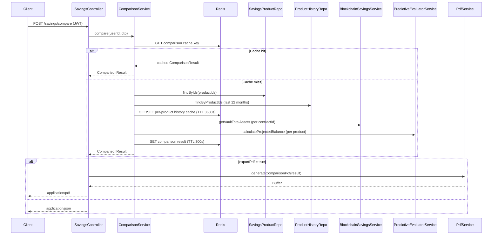

# Design Document: Savings Product Comparison API

## Overview

This document describes the technical design for the Savings Product Comparison API (`POST /savings/compare`). The feature extends the existing `SavingsModule` with a new endpoint that accepts 2–5 savings product IDs and returns a structured side-by-side comparison including APY, projected earnings, historical performance, a best-option recommendation, and optional PDF export.

The design follows the existing NestJS patterns in the savings module: a controller method delegates to a dedicated service, which orchestrates data from TypeORM repositories, `BlockchainSavingsService`, `PredictiveEvaluatorService`, and Redis cache.

---

## Architecture

The feature is self-contained within `backend/src/modules/savings/`. A new `ComparisonService` handles all comparison logic, keeping `SavingsService` focused on its existing responsibilities.



---

## Components and Interfaces

### New Files

| File | Purpose |
|---|---|
| `dto/compare-products.dto.ts` | Request body DTO with validation |
| `dto/comparison-result.dto.ts` | Response shape DTOs |
| `entities/product-history.entity.ts` | New TypeORM entity for historical rate data |
| `services/comparison.service.ts` | Core comparison orchestration logic |
| `services/comparison-pdf.service.ts` | PDF generation using `pdfkit` |

### Modified Files

| File | Change |
|---|---|
| `savings.controller.ts` | Add `POST /savings/compare` endpoint |
| `savings.module.ts` | Register new entity, services, and repository |

### Controller Method

```typescript
@Post('compare')
@UseGuards(JwtAuthGuard)
@HttpCode(HttpStatus.OK)
@ApiBearerAuth()
@ApiOperation({ summary: 'Compare savings products side-by-side' })
@ApiBody({ type: CompareProductsDto })
@ApiResponse({ status: 200, description: 'Comparison result', type: ComparisonResultDto })
@ApiResponse({ status: 400, description: 'Validation error' })
@ApiResponse({ status: 401, description: 'Unauthorized' })
@ApiResponse({ status: 404, description: 'Product not found' })
async compareProducts(
  @Body() dto: CompareProductsDto,
  @CurrentUser() user: { id: string },
  @Res() res: Response,
): Promise<void>
```

When `exportPdf` is true the controller calls `ComparisonPdfService.generate(result)` and writes the buffer with the appropriate headers. Otherwise it calls `res.json(result)`.

---

## Data Models

### Request DTO — `CompareProductsDto`

```typescript
class UserGoalsDto {
  optimizeFor?: 'return' | 'risk' | 'tenure';  // default: 'return'
  targetAmount?: number;                         // >= 0
  riskTolerance?: 'low' | 'medium' | 'high';
}

class CompareProductsDto {
  productIds: string[];          // @ArrayMinSize(2) @ArrayMaxSize(5) @IsUUID each
  principalAmount?: number;      // @Min(0)
  monthlyContribution?: number;  // @Min(0)
  userGoals?: UserGoalsDto;
  exportPdf?: boolean;           // default: false
}
```

### Response DTOs

```typescript
class HistoricalDataPointDto {
  date: string;           // ISO 8601 month string e.g. "2024-11"
  interestRate: number;
  apy: number;
}

class ProjectionDto {
  projectedBalance: number;
  totalInterestEarned: number;
  effectiveTenureMonths: number;
  belowMinimum?: boolean;        // true when principalAmount < product.minAmount
}

class ProductComparisonEntryDto {
  id: string;
  name: string;
  type: SavingsProductType;
  interestRate: number;
  apy: number;
  minAmount: number;
  maxAmount: number;
  tenureMonths: number | null;
  riskLevel: RiskLevel;
  tvlAmount: number;
  liveDataUnavailable?: boolean;
  projection?: ProjectionDto;
  historicalPerformance: HistoricalDataPointDto[];
}

class ComparisonResultDto {
  products: ProductComparisonEntryDto[];
  bestProductId: string;
  recommendationReason: string;
  projectionsUnavailable?: boolean;
  cachedAt: string;              // ISO 8601
}
```

### New Entity — `ProductHistory`

A new table `product_history` stores monthly historical rate snapshots. This table is populated by a separate admin/seeding mechanism (out of scope for this feature) and read by the comparison API.

```typescript
@Entity('product_history')
class ProductHistory {
  @PrimaryGeneratedColumn('uuid')
  id: string;

  @Column('uuid')
  productId: string;

  @Column({ type: 'varchar', length: 7 })  // e.g. "2024-11"
  month: string;

  @Column('decimal', { precision: 5, scale: 2 })
  interestRate: number;

  @Column('decimal', { precision: 6, scale: 4 })
  apy: number;

  @CreateDateColumn()
  createdAt: Date;

  @ManyToOne(() => SavingsProduct)
  @JoinColumn({ name: 'productId' })
  product: SavingsProduct;
}
```

Index: `(productId, month)` unique — prevents duplicate monthly entries.

### Cache Key Scheme

| Cache entry | Key format | TTL |
|---|---|---|
| Full comparison result | `comparison:{sortedIds}:{principal}:{monthly}:{goals}` | 300 s |
| Per-product history | `product_history:{productId}` | 3600 s |

The comparison cache key is built by JSON-serializing `{ ids: sorted(productIds), principal: principalAmount ?? null, monthly: monthlyContribution ?? null, goals: userGoals ?? null }` and hashing or base64-encoding it to keep key length bounded.

---

## APY Calculation

APY is computed inline per product using monthly compounding (n = 12):

```
APY = (1 + interestRate / 100 / 12)^12 - 1
```

This is a pure function with no external dependencies and is implemented as a private helper in `ComparisonService`.

---

## Best-Option Scoring

The scoring logic is a simple ranked sort with no weighted blending, keeping it deterministic and auditable:

| `optimizeFor` | Sort key | Direction |
|---|---|---|
| `"return"` (default) | `projectedBalance` (or `apy` when projections unavailable) | Descending |
| `"risk"` | `riskLevel` mapped to `{ LOW: 0, MEDIUM: 1, HIGH: 2 }` | Ascending |
| `"tenure"` | `tenureMonths` (null treated as `Infinity`) | Ascending |

The `recommendationReason` is a human-readable string generated from the winning criterion, e.g. `"Highest projected balance of 1,234.56 over 12 months"`.

---

## PDF Export

PDF generation uses the `pdfkit` npm package (already common in Node.js ecosystems, no heavy binary dependencies). `ComparisonPdfService` accepts a `ComparisonResultDto` and returns a `Buffer`.

Sections in the PDF:
1. Header with generation timestamp
2. Product metrics table (one column per product)
3. Projections table (if available)
4. Historical performance summary (last 3 data points per product for brevity)
5. Best-option recommendation callout

If `pdfkit` throws during generation, `ComparisonPdfService` lets the error propagate; the controller catches it and returns HTTP 500.

---

## Correctness Properties

*A property is a characteristic or behavior that should hold true across all valid executions of a system — essentially, a formal statement about what the system should do. Properties serve as the bridge between human-readable specifications and machine-verifiable correctness guarantees.*

### Property 1: Product ID array size is enforced

*For any* request array of product IDs, the API should accept it if and only if the array length is between 2 and 5 (inclusive); any array outside that range should be rejected with HTTP 400.

**Validates: Requirements 1.2, 1.3, 1.4**

---

### Property 2: Unknown product IDs produce 404

*For any* request that includes at least one product ID that does not correspond to an active `SavingsProduct` record, the API should return HTTP 404.

**Validates: Requirements 1.5**

---

### Property 3: Response contains exactly one entry per requested product

*For any* valid request with N product IDs (2 ≤ N ≤ 5), the `products` array in the response should contain exactly N entries, each with an `id` matching one of the requested product IDs.

**Validates: Requirements 2.1, 2.2**

---

### Property 4: APY formula is correct

*For any* `interestRate` value r ≥ 0, the computed `apy` field should equal `(1 + r / 100 / 12)^12 - 1`, within floating-point tolerance.

**Validates: Requirements 2.3**

---

### Property 5: Blockchain fallback sets liveDataUnavailable flag

*For any* product whose `contractId` is set, if `BlockchainSavingsService.getVaultTotalAssets` throws, the response entry for that product should use the entity's `tvlAmount` and have `liveDataUnavailable: true`.

**Validates: Requirements 2.5**

---

### Property 6: Projections absent when principalAmount is omitted

*For any* request that does not include `principalAmount`, the response should have `projectionsUnavailable: true` and no `projection` field on any product entry.

**Validates: Requirements 3.5**

---

### Property 7: Monthly contribution monotonically increases projected balance

*For any* product and any `principalAmount` ≥ 0, adding a positive `monthlyContribution` should produce a `projectedBalance` greater than or equal to the one computed without it.

**Validates: Requirements 3.3**

---

### Property 8: belowMinimum flag and minAmount substitution

*For any* product where `principalAmount` < `product.minAmount`, the projection entry should have `belowMinimum: true` and the `projectedBalance` should equal the value computed using `product.minAmount` as the principal.

**Validates: Requirements 3.6**

---

### Property 9: Return ranking selects highest projected balance (or APY)

*For any* set of products compared with `optimizeFor: "return"`, the `bestProductId` should be the product with the highest `projectedBalance` (or highest `apy` when projections are unavailable).

**Validates: Requirements 4.2, 4.5**

---

### Property 10: Risk ranking selects lowest risk level

*For any* set of products compared with `optimizeFor: "risk"`, the `bestProductId` should be the product with the lowest `riskLevel` (LOW < MEDIUM < HIGH).

**Validates: Requirements 4.3**

---

### Property 11: Tenure ranking selects shortest tenure

*For any* set of products compared with `optimizeFor: "tenure"`, the `bestProductId` should be the product with the smallest `tenureMonths` value.

**Validates: Requirements 4.4**

---

### Property 12: Recommendation fields are always present

*For any* valid comparison response, `bestProductId` should be a non-empty string matching one of the requested product IDs, and `recommendationReason` should be a non-empty string.

**Validates: Requirements 4.6**

---

### Property 13: Historical performance shape and ordering

*For any* product entry in the response, `historicalPerformance` should be an array of length ≤ 12 where each element has `date`, `interestRate`, and `apy` fields, and the `date` values are in ascending order.

**Validates: Requirements 5.1, 5.2, 5.3, 5.4**

---

### Property 14: Caching round-trip — identical requests share cachedAt

*For any* two identical comparison requests made within the 300-second TTL window, the second response should have the same `cachedAt` timestamp as the first, confirming the cached result was returned without re-querying.

**Validates: Requirements 6.1, 6.2, 6.3, 6.4**

---

## Error Handling

| Scenario | HTTP Status | Behavior |
|---|---|---|
| Missing or invalid JWT | 401 | `JwtAuthGuard` rejects before reaching service |
| `productIds` length < 2 or > 5 | 400 | `class-validator` rejects in DTO pipe |
| Invalid UUID in `productIds` | 400 | `@IsUUID()` decorator rejects |
| `principalAmount` < 0 | 400 | `@Min(0)` decorator rejects |
| Product ID not found or inactive | 404 | `ComparisonService` throws `NotFoundException` |
| `BlockchainSavingsService` error | 200 (partial) | Fallback to entity `tvlAmount`; `liveDataUnavailable: true` |
| PDF generation failure | 500 | Controller catches and returns `InternalServerErrorException` |
| Redis unavailable | 200 (degraded) | Cache operations are wrapped in try/catch; comparison proceeds without caching |

---

## Testing Strategy

### Unit Tests

Focus on isolated, deterministic behavior:

- `ComparisonService`: APY formula correctness for known inputs, scoring logic for each `optimizeFor` value, `belowMinimum` substitution, `projectionsUnavailable` flag when principal is absent, `liveDataUnavailable` fallback when blockchain throws.
- `ComparisonPdfService`: Verify the returned value is a non-empty `Buffer` for a valid `ComparisonResultDto`.
- DTO validation: Verify `class-validator` rejects arrays outside [2, 5] and negative amounts.

### Property-Based Tests

Use **`fast-check`** (already common in TypeScript/Node.js projects). Each property test runs a minimum of **100 iterations**.

Tag format: `// Feature: savings-product-comparison, Property {N}: {property_text}`

| Property | Test description |
|---|---|
| P1 — Array size enforcement | Generate arrays of length 0–10; assert accept iff 2 ≤ length ≤ 5 |
| P2 — Unknown product 404 | Generate requests with at least one non-existent UUID; assert 404 |
| P3 — Response cardinality | Generate N ∈ [2,5] valid product IDs; assert `products.length === N` |
| P4 — APY formula | Generate random `interestRate` ∈ [0, 100]; assert computed APY matches formula |
| P5 — Blockchain fallback | For any product with contractId, mock service to throw; assert fallback fields |
| P6 — Projections absent | Generate requests without `principalAmount`; assert `projectionsUnavailable: true` and no `projection` fields |
| P7 — Monthly contribution monotonicity | Generate principal and positive contribution; assert `projectedBalance(with) >= projectedBalance(without)` |
| P8 — belowMinimum substitution | Generate `principalAmount` < `minAmount`; assert flag and correct projected value |
| P9 — Return ranking | Generate products with distinct APYs; assert `bestProductId` is highest APY/balance product |
| P10 — Risk ranking | Generate products with distinct risk levels; assert `bestProductId` is lowest risk |
| P11 — Tenure ranking | Generate products with distinct tenures; assert `bestProductId` is shortest tenure |
| P12 — Recommendation fields | For any valid response; assert `bestProductId` ∈ requested IDs and `recommendationReason` non-empty |
| P13 — History shape and order | For any product with history records; assert length ≤ 12 and dates ascending |
| P14 — Cache round-trip | Make two identical requests within TTL; assert same `cachedAt` |

### Integration / E2E Tests

- `POST /savings/compare` without JWT → 401
- `POST /savings/compare` with `exportPdf: true` → `Content-Type: application/pdf`, `Content-Disposition` header present
- `POST /savings/compare` with `exportPdf: false` → `Content-Type: application/json`
- PDF generation failure → 500, no partial body
